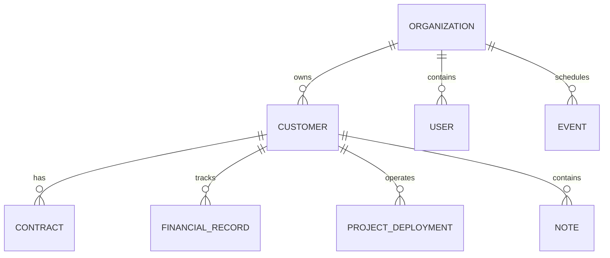

# StaxHQ Multi-Tenant Ready CRM — Architecture & System Design

**Date**: 2026-08-31  
**Project**: StaxHQ (Modern B2B Client & Document CRM)  
**Status**: Approved by User  

---

## 1. Executive Summary & Vision

StaxHQ is a purpose-built B2B Customer Relationship Management (CRM), Document Hub, and Financial Management platform. It replaces generic or restoration-specific software (such as Company Pulse) with a clean, modern, high-performance web platform tailored for managing:
1. **Customers & Prospects** (e.g., municipal and commercial clients such as "Town of Rehobeth").
2. **Document & Contract Management** (upload existing contracts, preview, print with company headers/watermarks, and execute digital e-signatures).
3. **Financial Hub** (MRR/ARR tracking, recurring retainer contracts, one-time project fees, and billing statuses).
4. **Project & Deployment Tracking** (monitoring systems/tools deployed to clients, active users, and milestones).
5. **Team Communication & Activity Timeline** (chronological notes feed with `@mention` team tagging, file attachments, and alerts).
6. **Integrated Calendar & Scheduling** (internal schedule board + Google Workspace Calendar integration).
7. **AI Copilot** (natural language reporting and instant querying across clients and financials).
8. **Tenant-Ready Architecture & Demo Switcher** (single-tenant feel by default, instant switch to an isolated "Demo Organization" for client presentations, and ready for full multi-tenant SaaS expansion).

---

## 2. Technical Stack & Architecture

* **Frontend Framework**: Next.js 15 (App Router, Server & Client Components) + React 19 + TypeScript.
* **Styling & Design System**: Tailwind CSS, Radix UI primitives, Lucide Icons, and Framer Motion for sleek micro-interactions.
* **Backend & Database**: Firebase Firestore (NoSQL, reactive subscriptions via `@react-firebase-hooks` or custom reactive hooks) + Firebase Authentication.
* **Storage**: Firebase Storage (bucket paths partitioned by `organizations/{orgId}/documents/{docId}`).
* **Engines Ported & Modernized from Company Pulse**:
  - **E-Signature & Canvas Engine**: HTML5 Canvas drawing pad, typed signature conversion, verification stamps, IP/audit trail logging.
  - **PDF Generation & Watermarking**: `jspdf` + `jspdf-autotable` with custom company headers and watermark overlays.
  - **AI Assistant**: Genkit / LLM integration for intelligent query handling and report generation.

---

## 3. Data Architecture & Schema Specification

All collections are partition-aware with `orgId` (defaulting to `"stax"` for internal company operations).



### 3.1 Data Models

#### `organizations/{orgId}`
```typescript
interface Organization {
  id: string;
  name: string; // e.g. "Stax"
  logoUrl?: string;
  address?: string;
  contactEmail?: string;
  phone?: string;
  taxId?: string;
  defaultHeaderHtml?: string;
  watermarkText?: string; // e.g. "CONFIDENTIAL" / "DRAFT"
  isDemo?: boolean;
  createdAt: number;
}
```

#### `users/{userId}`
```typescript
interface UserProfile {
  uid: string;
  email: string;
  displayName: string;
  photoUrl?: string;
  orgId: string;
  role: 'admin' | 'employee';
  googleCalendarConnected?: boolean;
  createdAt: number;
}
```

#### `customers/{customerId}`
```typescript
interface Customer {
  id: string;
  orgId: string;
  name: string; // e.g. "Town of Rehobeth"
  type: 'customer' | 'prospect' | 'partner';
  status: 'lead' | 'contacted' | 'proposal_sent' | 'active' | 'churned';
  industry?: string;
  website?: string;
  address?: {
    street?: string;
    city?: string;
    state?: string;
    zip?: string;
  };
  contacts: {
    id: string;
    name: string;
    title: string;
    email: string;
    phone: string;
    isPrimary: boolean;
  }[];
  financialSummary: {
    totalContractValue: number;
    recurringAmount: number;
    billingCycle: 'monthly' | 'annually' | 'one-time';
    paymentStatus: 'current' | 'pending' | 'overdue';
  };
  tags: string[];
  createdAt: number;
  updatedAt: number;
}
```

#### `contracts/{contractId}`
```typescript
interface ContractDocument {
  id: string;
  orgId: string;
  customerId: string;
  title: string;
  type: 'agreement' | 'proposal' | 'nda' | 'sla' | 'invoice' | 'custom';
  status: 'draft' | 'sent_for_signature' | 'signed' | 'expired';
  fileUrl: string; // Firebase Storage path
  fileName: string;
  fileSizeBytes: number;
  watermarkText?: string;
  signatureRequired: boolean;
  signatureData?: {
    signerName: string;
    signerEmail: string;
    signatureImageBase64?: string;
    signedAt: number;
    ipAddress?: string;
    auditLogId: string;
  };
  createdAt: number;
  updatedAt: number;
}
```

#### `notes/{noteId}`
```typescript
interface ActivityNote {
  id: string;
  orgId: string;
  customerId: string;
  projectId?: string;
  authorId: string;
  authorName: string;
  authorAvatar?: string;
  content: string; // Markdown or rich text with @[Name](userId)
  taggedUserIds: string[];
  category: 'general' | 'call_log' | 'meeting' | 'urgent' | 'contract';
  attachments: {
    name: string;
    url: string;
    sizeBytes: number;
  }[];
  createdAt: number;
}
```

#### `calendar_events/{eventId}`
```typescript
interface CalendarEvent {
  id: string;
  orgId: string;
  title: string;
  description?: string;
  customerId?: string;
  start: number; // timestamp
  end: number; // timestamp
  allDay: boolean;
  location?: string;
  attendeeUserIds: string[];
  googleEventId?: string;
  syncStatus?: 'synced' | 'local_only';
  type: 'meeting' | 'demo' | 'block' | 'milestone';
  createdAt: number;
}
```

---

## 4. Key Feature Modules & UI Workflows

### 4.1 Document Hub & Print/Signature Engine
1. **Upload**: Drag-and-drop PDF/DOCX files directly into customer records.
2. **Watermarking & Header Overlay**: Automatic company header injection (Logo, address, contact) and configurable watermarks (`"DRAFT"`, `"CONFIDENTIAL"`, `"SIGNED"`).
3. **1-Click Print & Export**: Native browser-friendly print layout and clean PDF download.
4. **Digital Signature Link (`/sign/[documentId]`)**: Public-facing secure signing page for clients to draw/type signatures with real-time audit logging.

### 4.2 Customer & Prospect Pipeline
1. **CRM List & Grid Views**: Filter by Status (*Lead, Proposal Sent, Active*), Type, or Tag.
2. **Customer Detail Command Center**: 
   - Header with quick status, contact cards, and financial health badge.
   - Tabs: *Overview, Documents & Contracts, Financials, Projects/Deployments, Activity Feed, Calendar*.

### 4.3 Team Communication Hub (@Mentions)
1. **Interactive Notes Feed**: Instant typing with `@` popup to tag team members.
2. **Notifications Bar**: Dropdown with badge alerts when tagged in a note or assigned an event.

### 4.4 Calendar & Google Workspace Sync
1. **Interactive Calendar Views**: Month, Week, Day, and Agenda views.
2. **Direct CRM Association**: Create meetings linked to a client with 1 click.
3. **Google Calendar Sync**: OAuth connect to synchronize events bidirectionally.

### 4.5 Financials Hub
1. Executive dashboard: Total Revenue, MRR, ARR, Contract Pipelines, and Renewal alerts.
2. Billing breakdown per customer.

### 4.6 AI Copilot
1. Chat drawer accessible on all pages.
2. Capability to query client records, summarize customer notes, and generate financial reports.

### 4.7 Admin Tab & Demo Switcher
1. **Company Settings & Branding**: Centralized logo, name, header, and watermark control.
2. **Demo Mode Switcher**: Instant switch in header to a pre-seeded `"Demo Organization"` with realistic sample clients and mock contracts.

---

## 5. Security & Permission Model

* **Admin Role**: Full access to all modules, Admin Tab, Billing/Financials, Team Management, and Company Branding.
* **Employee Role** (configured for future use): Access to Customers, Notes, Documents, and Calendar, with restricted access to company-wide financials and admin settings.

---

## 6. Implementation Roadmap Overview

1. **Phase 1**: Project Scaffolding & Design Foundation (Next.js 15, Tailwind, Radix UI, Firebase setup, App Config).
2. **Phase 2**: Core Data Layer, Org / Tenant Provider, and Demo Switcher.
3. **Phase 3**: Customer & Prospect Management Hub (Directory, CRUD, Detail Command Center).
4. **Phase 4**: Document Hub & Digital E-Signature Engine (PDF generation, Canvas pad, Headers & Watermarks).
5. **Phase 5**: Team Communication Hub (@Mentions, Activity Feed, Notifications).
6. **Phase 6**: Calendar & Google Workspace Sync.
7. **Phase 7**: Financial Hub & AI Reporting Copilot.
8. **Phase 8**: Admin Console, Polish, and Verification.
