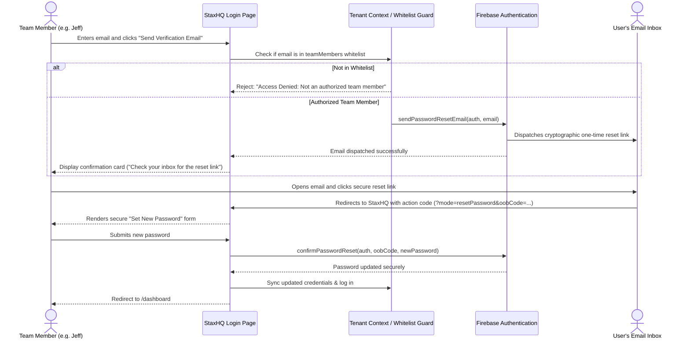

# Firebase Auth Email Verification & Team Whitelist Security Design

## Problem Statement
The previous password reset implementation allowed entering any email address on the login form and resetting the stored password immediately in the browser without out-of-band identity verification. This posed a security risk where an unauthenticated visitor could change another team member's password.

## Requirements
1. **Registered Email Whitelist Gate**: Only pre-authorized, active members in the `teamMembers` directory can initiate a password reset. Unregistered email addresses are rejected immediately.
2. **Out-of-Band Email Verification**: The password reset process must dispatch a cryptographically secure, single-use reset link to the user's verified inbox using Firebase Authentication (`sendPasswordResetEmail`).
3. **Secure Action Code Confirmation**: When the user clicks the reset link in their email, they are directed to the secure reset handler where they enter and confirm their new password via `confirmPasswordReset(auth, oobCode, newPassword)`.

## Architecture & Data Flow

## Security Controls
1. **Email Whitelisting**: Case-insensitive and trimmed matching against active team member roster.
2. **Cryptographic One-Time Tokens**: The `oobCode` issued by Firebase Auth expires after single use or time limit.
3. **Zero Direct Overwrite**: No unverified client-side updates to passwords without cryptographic verification.
4. **Graceful Fallbacks**: If Firebase Auth has not enabled Email/Password provider in the Firebase Console, the system informs the administrator while maintaining whitelist rejection for unauthorized users.
